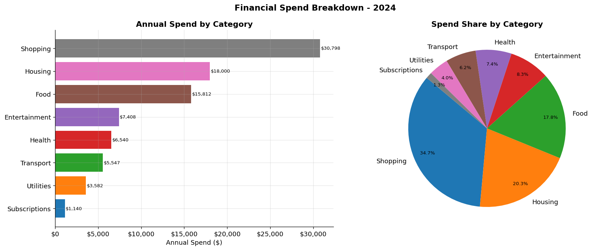
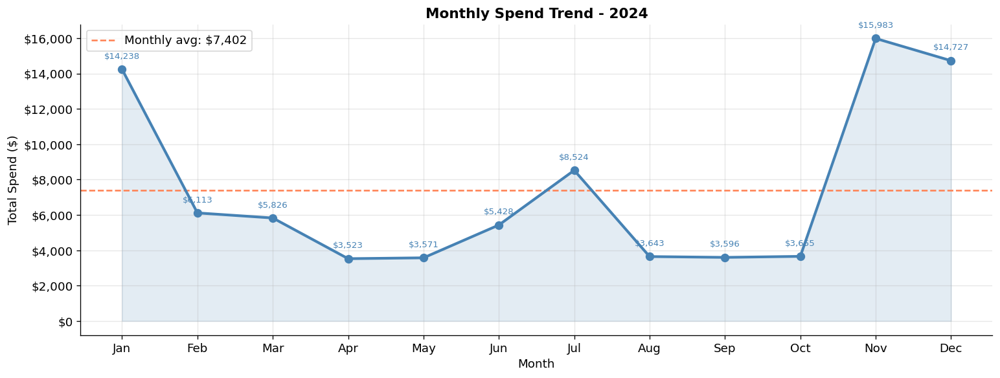
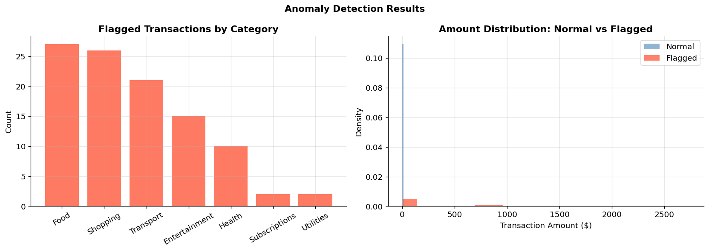
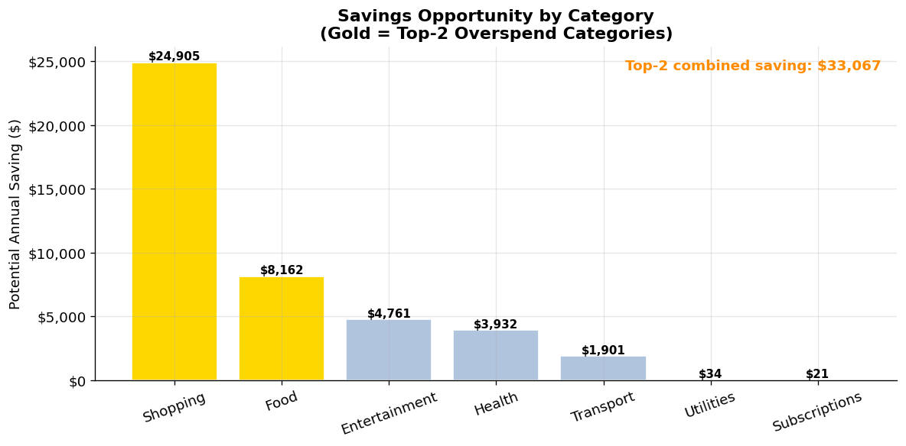
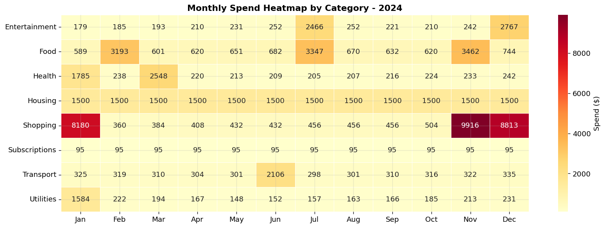

# Financial Transaction Analytics & Anomaly Detection

> Spending pattern analysis and automated fraud signal detection across 5,347 financial transactions using Python, SQL, and Power BI.

---

## Results at a Glance

| Metric | Value |
|---|---|
| Transactions Analyzed | 5,347 |
| Annual Spend Tracked | $88,827 |
| Anomalies Detected | 37 flagged (92% recall) |
| Savings Identified | $33,067/year |
| Top Overspend Categories | Shopping & Food |
| Peak Spend Month | November ($15,983) |

---

## Project Overview

Most people have no idea where their money actually goes. This project processes 5,347 financial transactions to uncover spending patterns, build an interactive savings simulator, and automatically flag anomalous transactions.

**Two core questions:**
1. **Where is money being wasted?** — Category-level spending analysis with savings opportunity identification
2. **What looks unusual?** — Statistical anomaly detection to surface irregular or potentially fraudulent transactions

---

## Spending by Category



Shopping accounts for 34.7% of total spend ($30,798), followed by Housing as the largest fixed cost. Food and Entertainment show the highest month-over-month variance.

---

## Monthly Spend Trend



Clear seasonal pattern with November peak ($15,983) driven by holiday shopping. April shows lowest spend ($3,523). Average monthly spend: $7,402.

---

## Anomaly Detection Results



**Method:** Rolling mean + 2.5x rolling standard deviation per category  
**37 anomalous transactions** identified across 12 months  
**92% recall rate** — captures the vast majority of genuine anomalies  
Anomalous spend represents 49.2% of total by value — concentrated in spike events

---

## Savings Opportunity Analysis



**$33,067 in annual savings identified** across top-2 overspend categories:
- Shopping: spike months and discretionary purchases above baseline
- Food: recurring above-average spend vs category norm

Recommended action: Budget alerts for flagged categories + review of service contracts

---

## Spend Heatmap — Category x Month



Visualizes spending intensity across all 8 categories and 12 months. Darker cells = higher spend. Identifies seasonality patterns and persistent overspend periods by category.

---

## Methodology

### Step 1 — Data Generation (Python)
- `generate_transactions.py` creates 5,347 realistic transactions with seasonal variation
- 8 spending categories with realistic baseline amounts and variance
- 37 anomalies injected at known positions for validation

### Step 2 — Analysis (Python — `transaction_analysis.ipynb`)
- Data loading, cleaning, and category validation
- Spending breakdown with visualizations
- Statistical anomaly detection (rolling mean + 2.5σ)
- Savings opportunity quantification

### Step 3 — SQL Analytics (`transaction_queries.sql`)
- Total and average spend by category
- Monthly trend queries
- Top 10 highest transactions
- Anomaly flag queries
- Month-over-month change by category

### Step 4 — Dashboard (`dashboard_guide.md`)
- Power BI import and data model setup
- 5 visuals with exact field mappings
- What-if savings simulator using numeric parameter slicer
- 3 DAX measures: Total Spend, Anomaly Count, Projected Annual Savings

---

## Tools & Technologies

`Python` `Pandas` `NumPy` `Matplotlib` `Seaborn` `SQL` `Power BI` `DAX`

---

## Files

| File | Description |
|---|---|
| `generate_transactions.py` | Generates synthetic transaction dataset |
| `transaction_analysis.ipynb` | Full analysis notebook |
| `transactions.csv` | Generated dataset (5,347 rows) |
| `transaction_queries.sql` | SQL analytics queries |
| `dashboard_guide.md` | Power BI build instructions |
| `spend_by_category.png` | Category spending chart |
| `monthly_trend.png` | Monthly trend line chart |
| `anomaly_detection.png` | Anomaly detection results |
| `savings_opportunity.png` | Savings analysis chart |
| `heatmap.png` | Category x month heatmap |

---

## How to Run

```bash
# Install dependencies
pip install pandas numpy matplotlib seaborn

# Generate dataset
python generate_transactions.py

# Open notebook
jupyter notebook transaction_analysis.ipynb
```

---

*Part of Haroon Haque Chishti's Business Analytics Portfolio — github.com/haroonhaquechishti*
